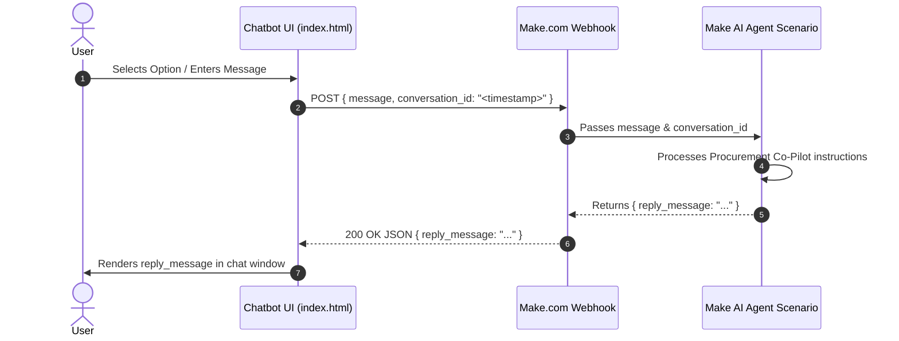

# System Architecture

## Overview
The chatbot application is a standalone Vue 3 / Vuetify client-side application designed for RFX procurement interactions.

## Component Hierarchy & Workflow

## Key Modules
1. **Welcome Screen & Workflow Selection (`chatbot/index.html`)**:
   - Initial screen with "Create an RFX" and "Check Vendor response" cards.
   - Text input box is hidden until an initial option is clicked.
2. **Make.com Webhook Integration**:
   - `useMessageStore.conversationId` initializes to a unique timestamp (`Date.now().toString()`) on page load and on `messageStore.init()` (new conversation).
   - In `createCompletion()`, messages are posted directly to the Make webhook with `{ message, conversation_id }`.
   - Attaches `x-make-apikey: aerchain3` (or configured key) and `x-mak-api-key` headers.
   - Parses `reply_message` (with fallback to `message`, `response`, `content`, or raw text) and appends it to the chat transcript.
3. **Settings & Configuration (`chatbot/config.json`)**:
   - Webhook URL, API key (`aerchain3`), and mode are loaded on startup with `.env` and default state fallbacks.
