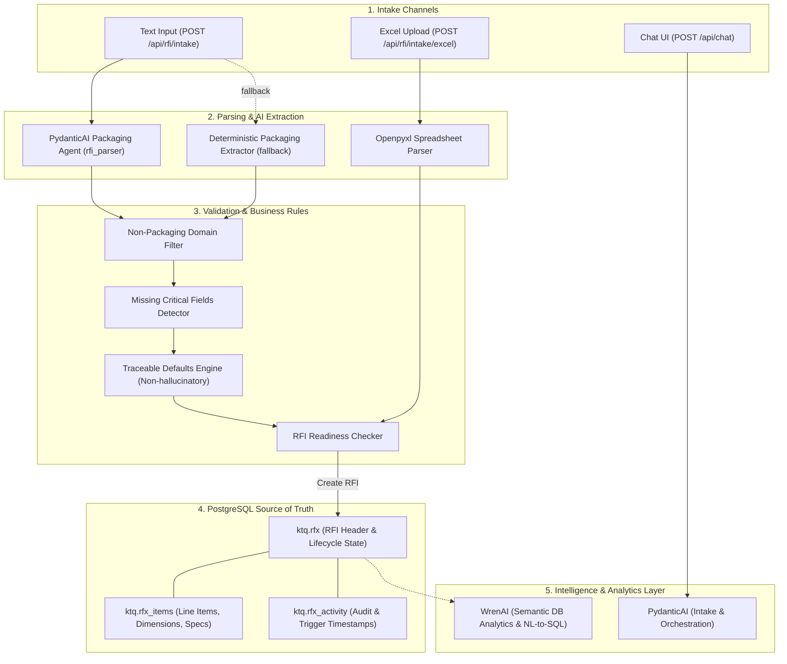

# System Architecture

## Overview
The application is a configurable multi-agent procurement platform integrating a FastAPI + PydanticAI backend with PostgreSQL, supporting the existing Vue 3 / Vuetify client-side application alongside an end-to-end Packaging RFI procurement workflow.

---

## Packaging RFI Workflow Architecture

---

## Core Modules & Design Decisions

### 1. Unified Backend (`backend/app/main.py`)
- Built on **FastAPI** with lifespan context for startup initialization of all agents.
- CORS middleware enabled for local UI and external origins.
- Static file serving mounted at `/ui` to serve `chatbot/index.html` directly.
- Health check endpoints:
  - `GET /health` and `GET /api/health`: General system and agent readiness.
  - `GET /health/db` and `GET /api/db/health`: Safe PostgreSQL connection, dynamic schema presence, and query verification without exposing credentials.

### 2. Database Layer & Dynamic Schema (`backend/app/db/`)
- **Dynamic Schema**: Does not hardcode schema names; uses the configured `DB_SCHEMA` (default: `ktq`).
- **Connection Isolation**: Connection context manager executes `SET search_path TO "{schema}", public` to ensure all queries resolve to the active tenant/environment schema.
- **Repository Abstraction (`RFIRepository`)**: Parameterized queries, atomic transactions for RFI + items creation, and an in-memory fallback for offline test isolation.
- **Tables**:
  - `ktq.rfx`: Master RFI record (`id`, `title`, `category`, `scope`, `currency`, `payment_terms`, `delivery_terms`, `validity_days`, `response_deadline`, `status`, `triggered_at`, `created_at`, `updated_at`).
  - `ktq.rfx_items`: Normalized line items (`item_number`, `description`, `quantity`, `unit`, `material`, `dimensions`, `specifications`, `target_price`, `currency`, `required_date`).
  - `ktq.rfx_activity`: Audit log (`rfx_id`, `activity_type`, `description`, `performed_by`, `created_at`).

### 3. PydanticAI Agent & Deterministic Extractor (`backend/app/intake/agent.py`)
- PydanticAI `rfi_parser` configured via `config/agents.yaml`.
- Produces strict `IntakeExtractionResult` and `PackagingRequirement` models rather than free-form text.
- Extracts dimensions into structured dictionaries (`length`, `width`, `height`, `unit`).
- Deterministic regex fallback guarantees 100% test reliability and offline execution without requiring live API keys.
- **No Hallucination**: Missing quantities, dimensions, prices, or dates are flagged explicitly rather than invented.

### 4. Excel Intake Parser (`backend/app/intake/excel_parser.py`)
- Reads `.xlsx` via `openpyxl` and `.csv` via standard library.
- Flexible header alias dictionary handles variations (`qty`, `volume`, `quantity` → `quantity`; `specs`, `notes` → `specifications`).
- Captures row-level errors and skips blank or malformed lines without failing the entire file.

### 5. RFI Lifecycle & REST API (`backend/app/api/rfi.py`)
- Lifecycle states: `DRAFT` → `READY` → `TRIGGERED` → `RESPONSES_PENDING` → `COMPLETED`.
- `POST /api/rfi/intake`: Text requirements intake.
- `POST /api/rfi/intake/excel`: Spreadsheet requirement upload.
- `POST /api/rfi`: Direct RFI creation.
- `GET /api/rfi/{id}`: Full RFI detail retrieval.
- `PATCH /api/rfi/{id}`: Safe updates to permitted fields.
- `POST /api/rfi/{id}/trigger`: Validates readiness, transitions status to `TRIGGERED`, records `triggered_at`.

### 6. WrenAI Role & Intelligence Layer
- WrenAI is retained as a secondary intelligence layer for semantic analytics and natural-language reporting over PostgreSQL data (e.g., supplier response times, price variance by packaging category, pending RFIs).
- The primary intake workflow does not block on WrenAI, ensuring low-latency, resilient procurement operations.
