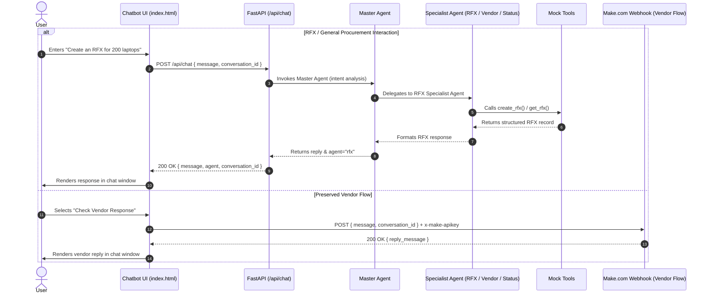

# System Architecture

## Overview
The application is a configurable multi-agent chatbot system for procurement workflows, integrating the existing Vue 3 / Vuetify client-side application with a FastAPI + PydanticAI multi-agent backend.

## Multi-Agent Hierarchy & Workflow

## Core Modules & Design Decisions

### 1. Unified Backend (`backend/app/main.py`)
- Built on **FastAPI** with lifespan context for startup initialization of all agents.
- CORS middleware enabled for seamless local development and multi-port frontend execution.
- Static file serving mounted at `/ui` to serve `chatbot/index.html` directly from the backend server.
- Health check route at `/api/health`.

### 2. Provider Abstraction (`backend/app/providers/factory.py`)
- Decouples PydanticAI models from specific cloud SDKs.
- Supports **OpenAI**, **Anthropic**, **Gemini/Google**, **Ollama**, and **TestModel**.
- Graceful offline fallback: if API credentials are not supplied or network is blocked, falls back to mock execution without crashing.

### 3. Agent Factory & Decoupled Configuration (`config/llms.yaml`, `config/agents.yaml`)
- `config/llms.yaml` defines LLM parameters (`temperature`, `max_tokens`, `provider`, `model`).
- `config/agents.yaml` defines agent roles and maps each to an LLM preset.
- Switching an agent's underlying model is done purely via YAML without editing Python code.
- Dynamic registry (`AgentRegistry`) in `backend/app/agents/factory.py` manages agent lifecycle.

### 4. Specialist Agents & Mock Tools
- **Master Agent** (`backend/app/agents/master.py`): Intent classification and delegation tools (`delegate_to_rfx`, `delegate_to_vendor`, `delegate_to_status`).
- **RFX Agent** (`backend/app/agents/rfx.py`): Tools `create_rfx()`, `get_rfx()`.
- **Vendor Agent** (`backend/app/agents/vendor.py`): Tools `search_vendors()`, `get_vendor_status()`.
- **Status Agent** (`backend/app/agents/status.py`): Tools `get_rfx_status()`, `get_vendor_status()`.
- Mock tools in `backend/app/tools/` are cleanly marked and isolated to allow direct swapping with live databases, ERP APIs, or Make.com scenarios.

### 5. Frontend Integration & Vendor Flow Preservation
- Reuses existing Vue 3 / Vuetify frontend without rebuilding.
- Routes RFX, procurement creation, and general conversation to `POST /api/chat`.
- Vendor flow ("Check Vendor response") continues using `vendorWebhookUrl` (`https://hook.eu1.make.com/...`) with `x-make-apikey: aerchain3` headers, preserving the existing vendor workflow unchanged.
