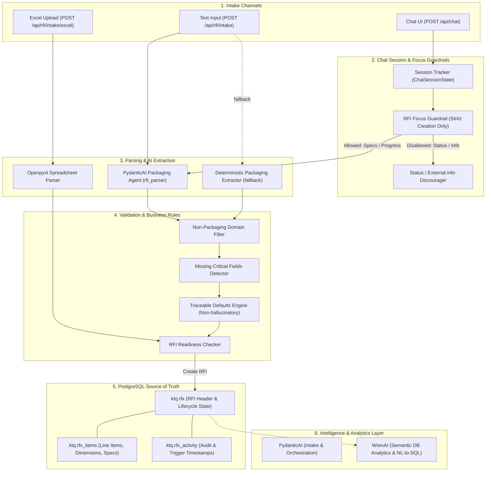
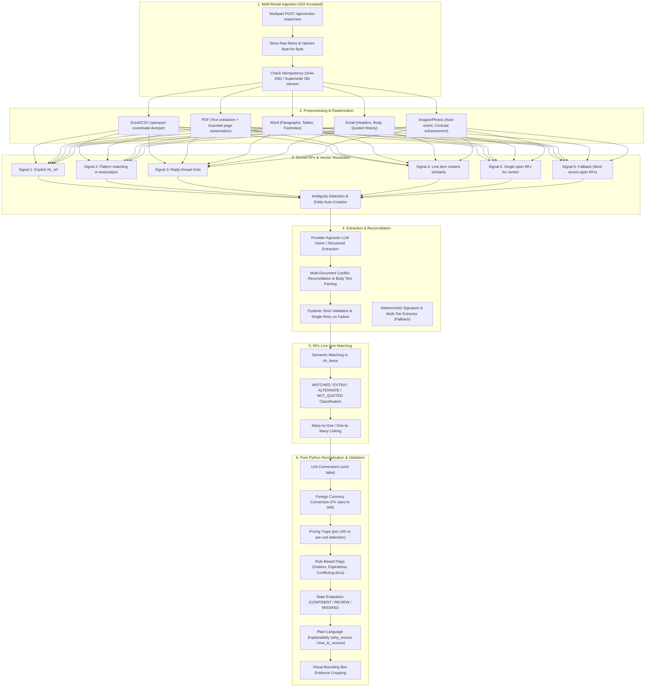
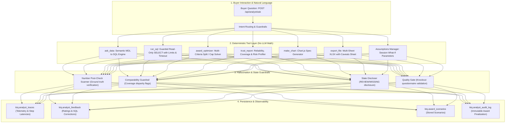
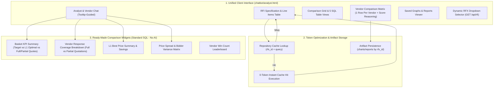

# System Architecture

## Overview
The application is a configurable multi-agent procurement platform integrating a FastAPI + PydanticAI backend with PostgreSQL, supporting the Vue 3 / Vuetify client-side application alongside an end-to-end Packaging RFI procurement workflow.

---

## Packaging RFI Workflow Architecture



---

## Core Modules & Design Decisions

### 1. Unified Backend & Serverless Runtime (`backend/app/main.py` & `api/index.py`)
- Built on **FastAPI** with lifespan context for startup initialization of all agents.
- Serverless execution support on **Vercel** via [api/index.py](file:///Users/akshaykumar/code/ktq2/api/index.py) ASGI entrypoint and [vercel.json](file:///Users/akshaykumar/code/ktq2/vercel.json) rewrites.
- CORS middleware enabled for local UI and external origins.
- Static file serving mounted at `/ui` to serve `chatbot/index.html` directly.
- Health check endpoints:
  - `GET /health` and `GET /api/health`: General system and agent readiness.
  - `GET /health/db` and `GET /api/db/health`: Safe PostgreSQL connection, dynamic schema presence, and query verification without exposing credentials.

### 2. Conversational RFI Workflow & Guardrails (`backend/app/agents/master.py`)
- **Session Management (`ChatSessionState`)**: Tracks conversation mode (`is_rfi_workflow`), active draft RFI ID (`active_rfi_id`), pending confirmation state (`pending_confirmation`), and message turn count per `conversation_id`.
- **Single RFI Draft Lifecycle**:
  - Starter command (`Create an RFI`) guides requirement intake without prematurely creating records. Direct packaging submissions automatically initialize draft creation.
  - Initial requirement intake creates the active RFI draft record and persists it to `RFIRepository`.
  - Subsequent inputs work on the **same active RFI** rather than creating new RFI records.
    - **Enterprise Tabular & Key-Value BOQ Parsing**: Supports pasting structured data, multi-column TSV/Excel/pipe tables, or key-value annotated rows (e.g. `BOQ Item #`, `SKU Code`, `Item Description`, `Category`, `Target BOQ Quantity`, `Standard UOM`, `Internal Baseline (INR)`, `Target Lead Time (Days)`). Maps 30+ items into typed line items with preserved SKU codes, quantities, UOMs, INR baseline prices, and 2D/3D dimensions.
    - **Document Header & Footer Instruction Filtering**: Automatically extracts document header terms (`RFI Reference`, `Scope`, `Target Validity`, `Baseline Currency`) into RFI metadata and isolates footer commercial instructions (`MANDATORY SOURCING & COMMERCIAL INSTRUCTIONS`) from line items.
    - **Intent Guardrails & Word Boundaries**: Strict regex word-boundary matching (`\b(update|change|modify|set|adjust|edit)\b`) and multi-line safeguards prevent false-positive item modification triggers on commercial clauses (e.g. `"cash settlement terms"`).
    - **Session-Scoped RFI Isolation**: Eliminates cross-session bleed-over by isolating active draft IDs to the active session without falling back to historical database records.
    - **Solicitation Preamble & Table Header Filtering**: RFP preambles (e.g. `Bidding Vendors are requested to provide itemized rates...`) and table header rows are filtered out from becoming line items or RFI titles.
    - **Commercial Terms Sanitization**: Validates length and format of commercial terms to reject stray single-character tokens (e.g., `Payment Terms: S`).
    - **Dynamic Natural Language Terms & Line Item Operations**:
      - **Commercial Terms Updates & Resets**: Evaluated prior to item modifications; extracts terms adjustments (e.g., `"payment terms update it to 10 days after delivery"`, `"delivery terms update it to Pune plant (DDP)"`, `"change currency to USD"`, `"update quote validity to 45 days"`) and resets (e.g., `"remove payment terms"`, `"clear delivery terms"`) without unintended line item deletion.
      - **Multi-Item & Compound Modifications**: Supports compound sentences modifying multiple items simultaneously (e.g. `"update quantity of 1 to 350, and 2 to 300 and 3 to 500 with baseline of ₹80"`).
      - **Flexible Phrasing & Code Normalization**: Tolerates phrasing variations (`"update quantity of 1 to 350"`, `"update line item 1 quantity to 300"`, `"update Pkg-001] 3-Ply Corrugated Box () to 300 pieces"`), normalizes item codes, and handles target baseline prices.
      - **Negative Confirmation Precedence**: When users say `"no, update existing item"`, the pending duplicate addition is cancelled and the update is applied immediately.
      - **Command Filtering in Intake**: Input command clauses and fragments are strictly filtered from becoming bogus packaging line items.
      - **Batch Range Removals**: e.g., `remove items 33 to 39`, `remove 33-39`, `delete 1-5`, `delete items from 3 to 5`.
      - **Comma-Separated & Conjunction Lists**: e.g., `remove items 2, 4, 6`, `delete 1, 3`, `remove item 2 and item 4`.
      - **Relative Removals**: `remove last item`, `remove last 7 items`.
      - **Keyword/Code Removals**: `remove [Pkg-029]`, `remove brown tape`.
      - **Attribute Modifications**: `update item 1 dimensions to 450x350x250 mm`, `change item 1 material to 7 ply heavy kraft`, `update item 1 quantity to 1500`, `change item 2 target price to 20 INR`, `update item 1 delivery date to 2026-12-01`.
      - **Contiguous Re-indexing**: `RFIRepository.remove_items()` re-sequences remaining line item numbers consecutively (`1..N`) via PostgreSQL `ROW_NUMBER()` and memory fallback.
    - **Duplicate Detection & Confirmation**: If an incoming line item matches an existing item in the draft, the workflow prompts for explicit confirmation before adding or updating.
- **Strict Guardrails**:
  - Inquiries for status of existing RFIs (e.g. `What is the status of RFX-101?`, `Check vendor response`) are discouraged and redirected to completing RFI creation.
  - External inquiries (vendor lookups, directory searches, general questions) are discouraged and redirected to RFI creation.
- **UI Progress & Outcome Loader (`chatbot/index.html`)**:
  - Dynamic loader bubble and input field loading bar displayed while `generating == true`.
  - Welcome card configured with `Create an RFI`.

### 3. Database Layer & Dynamic Schema (`backend/app/db/`)
- **Dynamic Schema**: Does not hardcode schema names; uses the configured `DB_SCHEMA` (default: `ktq`).
- **Connection Isolation**: Connection context manager executes `SET search_path TO "{schema}", public` to ensure all queries resolve to the active tenant/environment schema.
- **Repository Abstraction (`RFIRepository`)**: Parameterized queries, atomic transactions for RFI + items creation, and an in-memory fallback for offline test isolation.
- **Tables**:
  - `ktq.rfx`: Master RFI record (`id`, `title`, `category`, `scope`, `currency`, `payment_terms`, `delivery_terms`, `validity_days`, `response_deadline`, `status`, `triggered_at`, `created_at`, `updated_at`).
  - `ktq.rfx_items`: Normalized line items (`item_number`, `description`, `quantity`, `unit`, `material`, `dimensions`, `specifications`, `target_price`, `currency`, `required_date`).
  - `ktq.rfx_activity`: Audit log (`rfx_id`, `activity_type`, `description`, `performed_by`, `created_at`).

### 4. LLM Provider Factory (`backend/app/providers/factory.py`)
- `create_model()` instantiates `PydanticAI` models (`OpenAIChatModel`, `AnthropicModel`, `GoogleModel`, `OllamaModel`).
- **Strict Credential Validation**: Default `fallback_to_mock=False` ensures missing API keys raise an explicit `ValueError` rather than silently returning mock models in production.
- Explicit mock/test models (`provider: "test"` or `fallback_to_mock=True`) are preserved for unit testing.

### 5. PydanticAI Agent & LLM-First Extraction (`backend/app/intake/agent.py`)
- PydanticAI `rfi_parser` configured via `config/agents.yaml`.
- **LLM as First Choice**: The PydanticAI LLM agent is the primary engine for requirement extraction, category classification, dimension parsing, and commercial terms isolation.
- Produces strict `IntakeExtractionResult` and `PackagingRequirement` models rather than free-form text.
- **Multi-Line Item Support**: Robustly segments multi-item compound requirements (e.g., `1000 corrugated boxes, 300 x 200 x 150 mm, and 300 rolls of brown tape`) into multiple typed `PackagingRequirement` line items with independent dimensions, units, and materials.
- Extracts dimensions into structured dictionaries (`length`, `width`, `height`, `unit`).
- Deterministic regex fallback acts as a high-reliability fallback for offline testing or unconfigured API keys.
- **No Hallucination**: Missing quantities, dimensions, prices, or dates are flagged explicitly rather than invented.

### 6. Excel Intake Parser (`backend/app/intake/excel_parser.py`)
- Reads `.xlsx` via `openpyxl` and `.csv` via standard library.
- Flexible header alias dictionary handles variations (`qty`, `volume`, `quantity` → `quantity`; `specs`, `notes` → `specifications`).
- Captures row-level errors and skips blank or malformed lines without failing the entire file.

### 7. RFI Lifecycle & REST API (`backend/app/api/rfi.py`)
- Lifecycle states: `DRAFT` → `READY` → `TRIGGERED` → `RESPONSES_PENDING` → `COMPLETED`.
- `POST /api/rfi/intake`: Text requirements intake.
- `POST /api/rfi/intake/excel`: Spreadsheet requirement upload.
- `POST /api/rfi`: Direct RFI creation.
- `GET /api/rfi/{id}`: Full RFI detail retrieval.
- `PATCH /api/rfi/{id}`: Safe updates to permitted fields.
- `POST /api/rfi/{id}/trigger`: Validates readiness, transitions status to `TRIGGERED`, records `triggered_at`.

### 8. Semantic Analytics & Decision Intelligence Layer (`backend/app/analyst/`)
- **Semantic Modeling**: Defines domain models and column descriptions (`config/wren_semantic_model.yaml`, `config/wren_mdl.json`).
- **Few-Shot Retrieval**: Matches relevant procurement question-to-SQL examples (`config/wren_examples.yaml`).
- **Self-Correction Loop**: Single-retry execution recovery feedback loop correcting syntax/column errors.
- **Decision Engine**: Coordinates deterministic optimization, risk auditing, chart generation, and multi-sheet XLSX export packs.


## Step 2: Vendor Quotation Intake & Extraction Architecture



### State Machine Lifecycle
`received` ➔ `preprocessing` ➔ `extracting` ➔ `resolving` ➔ `matching` ➔ `normalizing` ➔ `validating` ➔ `done` | `needs_review` | `failed`

### Read-Only SQL Views for Analysis
1. `v_response_items_current`: Clean current line items with RFx item details, normalized prices in INR, flags, and crop URLs.
2. `v_vendor_coverage`: Summary per vendor response (total items, quoted count, coverage %, min/max price, open critical flags).
3. `v_open_flags`: Unresolved review flags with plain-language explanations for buyer intervention.
4. `v_rfx_comparison`: Cross-vendor comparison table per RFx item, computing lowest normalized price and ranking.

---

---

## Step 3: Decision Analyst & Award Optimization Architecture



### Deterministic Principles
1. **LLM Understands & Narrates; Python & PostgreSQL Compute**: Every calculation, ranking, sum, and allocation comes from deterministic tools.
2. **Comparability First**: Overall totals are never compared without checking and stating line item coverage.
3. **Traceability Post-Check**: All figures in generated text are verified against tool outputs; ungrounded numbers automatically downgrade confidence.
4. **Governed Decision Scenarios**: Allocation optimizations serve strictly as decision-support simulations to evaluate sourcing strategies.
5. **No Binding Awards**: The chat assistant and analyst screens provide decision-support intelligence only; binding line item awards and RFX status transitions to awarded are future scope.

---

## Step 4: Unified Decision Analyst & Token-Optimized Artifact Architecture



### Ready-Made Standard SQL Comparison Queries
1. **L1 Best Price & Savings**:
   ```sql
   SELECT ri.item_number, ri.description, ri.quantity, ri.target_price,
          c.vendor_name as l1_vendor, MIN(c.effective_price_inr) as l1_price
   FROM ktq.rfx_items ri
   JOIN ktq.v_rfx_comparison c ON ri.id = c.rfx_item_id
   WHERE c.rfx_id = :rfx_id
   GROUP BY ri.id, ri.item_number, ri.description, ri.quantity, ri.target_price, c.vendor_name;
   ```
2. **Price Spread & Bidder Variance**:
   ```sql
   SELECT item_number, description, COUNT(DISTINCT vendor_id) as bidder_count,
          MIN(effective_price_inr) as min_price, MAX(effective_price_inr) as max_price,
          (MAX(effective_price_inr) - MIN(effective_price_inr)) as price_spread
   FROM ktq.v_rfx_comparison
   WHERE rfx_id = :rfx_id AND effective_price_inr IS NOT NULL
   GROUP BY item_number, description
   ORDER BY item_number;
   ```

---

## Running Tests

Run the full pytest suite:

```bash
PYTHONPATH=. .venv/bin/pytest tests/ backend/tests/ -v
```

Test logs are output to [`artifacts/logs/test_full_suite.log`](file:///Users/akshaykumar/code/ktq2/artifacts/logs/test_full_suite.log).

