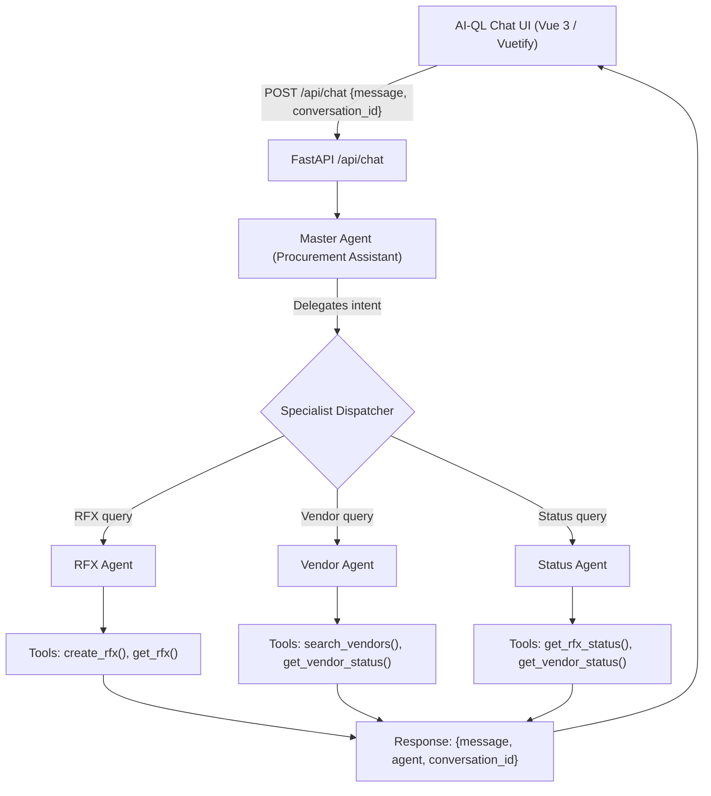

# Implementation Plan: Multi-Agent Chatbot Product

## Objective
Transform the existing AI-QL Chat UI repository into a configurable multi-agent chatbot system using FastAPI and PydanticAI, preserving and connecting the existing Vue 3 frontend.

## Proposed Architecture

## Phased Execution Plan

### Phase 1: Configuration & Provider Abstraction
1. Create `config/llms.yaml` for model definitions (provider, model name, temperature, max_tokens).
2. Create `config/agents.yaml` for agent configurations (llm reference, system instructions).
3. Create `.env.example` and update `.gitignore` (safeguarding API keys and `.venv`).
4. Implement `backend/app/config/settings.py` to parse YAML configurations and environment secrets with Pydantic.
5. Implement `backend/app/providers/factory.py` for provider abstraction (OpenAI, Anthropic, Gemini, Ollama, and test/mock fallback).

### Phase 2: Mock Tools & Specialist Agents
1. Implement `backend/app/tools/rfx.py`, `backend/app/tools/vendor.py`, and `backend/app/tools/status.py`.
   - Mock functions clearly annotated with docstrings and type hints.
   - Initial tools: `create_rfx()`, `get_rfx()`, `search_vendors()`, `get_vendor_status()`, `get_rfx_status()`.
2. Implement PydanticAI agent modules:
   - `backend/app/agents/rfx.py`
   - `backend/app/agents/vendor.py`
   - `backend/app/agents/status.py`
   - `backend/app/agents/master.py`
3. Implement `backend/app/agents/factory.py` to dynamically load agents from `config/agents.yaml`.

### Phase 3: FastAPI Backend & API Layer
1. Implement `backend/app/api/chat.py`:
   - Request schema: `ChatRequest(message: str, conversation_id: str | None = None)`
   - Response schema: `ChatResponse(message: str, agent: str, conversation_id: str)`
   - Orchestration: Call Master Agent, route to Specialist Agent, execute tools, return structured response.
2. Implement `backend/app/main.py`:
   - CORS middleware enabled for local frontend dev/serve.
   - Static file mounting for serving `chatbot/` frontend directly from FastAPI root or via `/ui`.
   - Healthcheck `/api/health`.

### Phase 4: Frontend UI Integration
1. Configure `chatbot/config.json` with the new endpoint (`http://localhost:8000/api/chat` or relative `/api/chat`).
2. Verify `chatbot/index.html` sends `{ message, conversation_id }` and handles `{ message, agent, conversation_id }`.
3. Support displaying which agent processed the message (e.g. tag/chip or message metadata).

### Phase 5: Testing, Validation & Documentation
1. Create pytest test suite in `backend/tests/` covering:
   - Config loading (`llms.yaml`, `agents.yaml`).
   - Provider factory initialization.
   - Specialist agent tool executions.
   - Master agent delegation / orchestration.
   - `/api/chat` endpoint requests and responses.
2. Execute test suite and store logs in `artifacts/logs/test_run.log`.
3. Update `README.md`, `architecture.md`, and `AI_context.md`.
